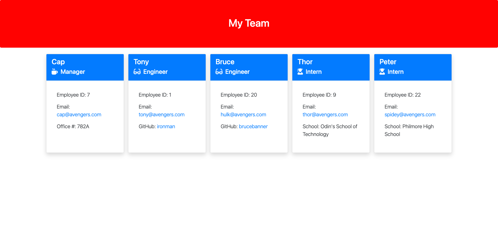

# team-profile-generator

---



Generated My Team Page

---


## Description

Using node.js with the inquirer and fs modules, create a team profile generator written with JavaScript classes.  Code will be tested using jest.

---

## Table of Contents

* [Installation](#installation)

* [Usage](#usage)

* [Testing](#testing) 

* [License](#license)

* [Contributing](#Contributing)

* [Questions](#Questions)

---

## Installation

Just run the following to install the dependcies (inquirer):

```
npm i
```

---

## Usage

The program can be run entering:

```
node app

```

---

## Testing

To run tests on the application, please run:

```
npm test
```

---

## License

None

---

## Contributing

Please report any issues using my contact information below.

---

## Questions
GitHub Profile: https://github.com/swillrich5

Email Address: swillrich@gmail.com
